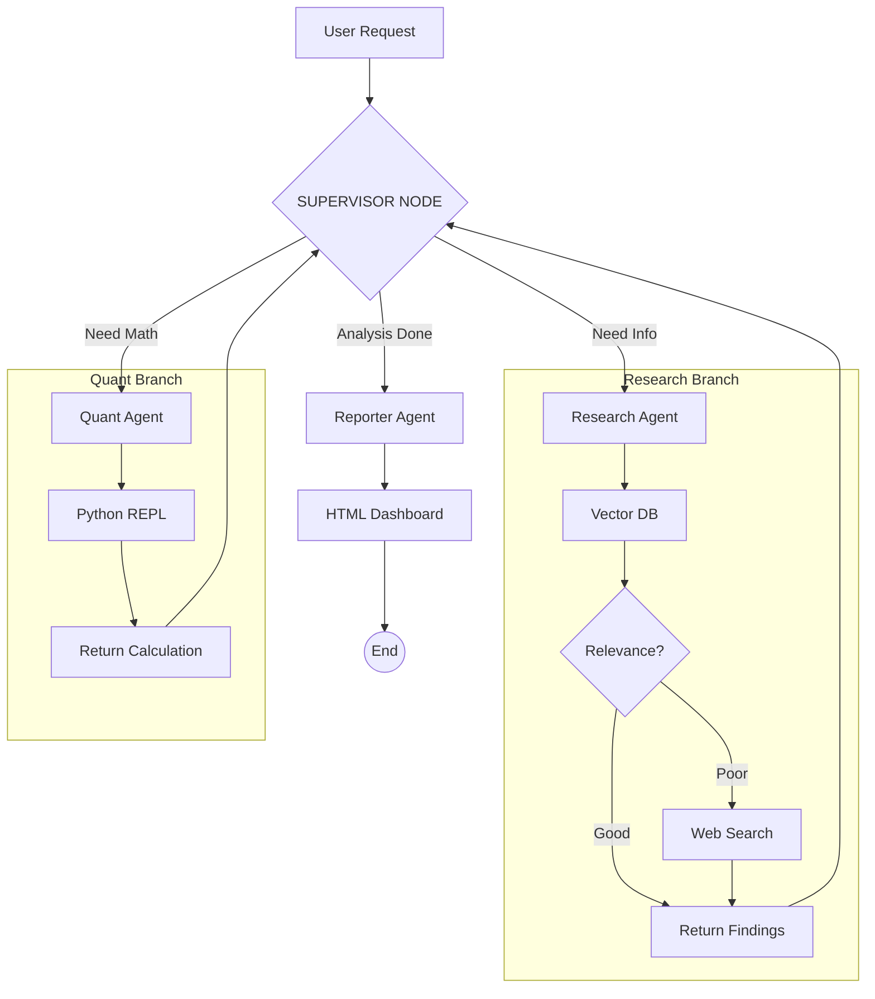

# 🏦 TITAN: Autonomous Financial Intelligence Platform

    

**TITAN** is an advanced Multi-Agent System designed to perform deep financial analysis and audit tasks on SEC 10-K filings. It employs a **Hierarchical Agentic Architecture** powered by LangGraph, where a Supervisor delegates tasks to specialized workers (Research, Quant, Reporting).

---

## 🧠 Agentic Architecture (The "Deep Analyzer")

TITAN has evolved from a linear RAG into a **Supervisor-Worker** topology. A central orchestrator creates a plan and loops through specialized agents until the analysis is complete.

---

## 🏗️ Architecture & Tech Stack

- **Core Backend:** Python 3.12+, FastAPI (Async), SQLModel.
- **Orchestration:** LangGraph (Hierarchical StateGraph with PostgreSQL Persistence).
- **Database:** PostgreSQL 16 + `pgvector` (Dockerized).
- **Data Engineering:** `sec-edgar-downloader`, BeautifulSoup4.
- **Inference:** Local LLMs via **Ollama** (Llama 3.2).
- **Tools:**
  - **Tavily AI:** Real-time Web Search.
  - **Python REPL:** Sandboxed code execution for precise financial math.
- **Observability:** **LangSmith** (Tracing & Monitoring).
- **Reporting Engine:** Jinja2 + TailwindCSS.

---

## 🚀 Quick Start

### 1\. Prerequisites

- Python 3.12+
- Docker & Docker Compose
- Poetry
- **Ollama** running locally.

### 2\. Setup

    # Clone the repository
    git clone https://github.com/rauldgarcia/titan-platform.git
    cd titan-platform

    # Install dependencies
    poetry install

    # Configure Secrets (.env)
    # TAVILY_API_KEY=tvly-xxxx
    # LANGCHAIN_API_KEY=lsv2_xxxx

    # Start Infrastructure
    sudo docker compose up -d

### 3\. Run the API

    poetry run uvicorn app.main:app --reload

---

### ✅ Completed Phases

- **Phase 1: Foundation**
  - \[x\] Environment Setup (Poetry, Docker, Git).
  - \[x\] Async Database Layer (Postgres + pgvector).
- **Phase 2: Data Engineering (ETL)**
  - \[x\] SEC Downloader Script.
  - \[x\] HTML-to-Text Parser (BeautifulSoup).
  - \[x\] GPU-Accelerated Vectorization (SentenceTransformers).
- **Phase 3: The Brain (Inference)**
  - \[x\] Semantic Search Service (Cosine Similarity).
  - \[x\] RAG Integration with Local LLMs (Ollama).
- **Phase 4: Agentic Workflow v1**
  - \[x\] LangGraph State Definition.
  - \[x\] Self-Correction Logic (Document Grader).
  - \[x\] Web Search Fallback (Tavily).
  - \[x\] **Reporting Engine:** Jinja2 + TailwindCSS HTML Generation.
  - \[x\] **Refactoring:** Centralized Prompts & Clean Architecture.
- **Phase 5: Advanced Orchestration (The "Deep Analyzer")**
  - \[x\] **Persistent Memory:** Replace in-memory checkpointer with PostgreSQL persistence (Long-running threads).
  - \[x\] **Hierarchical Agents:** Implement a "Supervisor" node to delegate tasks.
  - \[x\] **Quantitative Tool:** Connect Python REPL for real-time financial calculations (Ratios, Growth rates).

### 🚧 In Progress & Future Steps

- **Phase 6: MLOps & Quality Engineering**
  - \[ \] **Unit & Integration Testing:** Comprehensive Pytest suite for agents and API.
  - \[ \] **CI/CD Pipelines:** GitHub Actions for automated linting, testing, and Docker builds.
  - \[ \] **Evaluation:** Implement RAGAS to measure retrieval accuracy and hallucination rates.
- **Phase 7: Full Stack Experience**
  - \[ \] **Frontend Client:** React Application for chat interface and report visualization.
  - \[ \] **Cloud Deployment:** Deploy backend to GCP Cloud Run.

---

## 🛡️ License

Private Portfolio Project - Raúl Daniel García Ramón.
