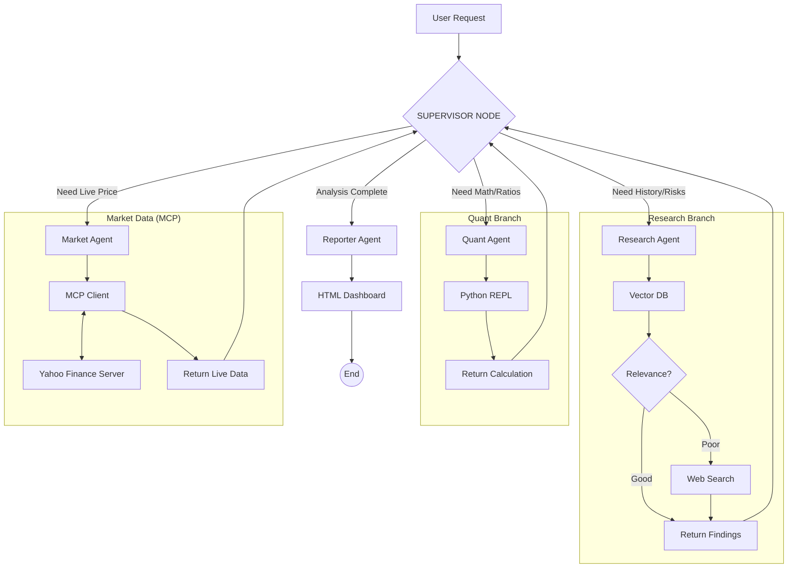

# 🏦 TITAN: Autonomous Financial Intelligence Platform

**TITAN** is an advanced Multi-Agent System designed to perform deep financial analysis and audit tasks on SEC 10-K filings. It employs a **Hierarchical Agentic Architecture** powered by LangGraph, where a Supervisor delegates tasks to specialized workers (Research, Quant, Market Data, Reporting).

---

## 🧠 Agentic Architecture (The "Deep Analyzer")

TITAN utilizes a **Supervisor-Worker** topology with **Model Context Protocol (MCP)** integration. The Supervisor orchestrates a team of agents, maintaining a feedback loop until the analysis is comprehensive.

---

## 🧪 Analysis Capabilities & Examples

TITAN can handle various types of financial queries, from simple retrieval to complex multi-step reasoning.

### 1\. Deep Strategic Analysis (RAG + Reasoning)

    "Analyze the key risk factors and strategic outlook for Apple (AAPL) based on their latest 10-K."

### 2\. Quantitative Analysis (RAG + Python Calculation)

    "Based on Microsoft's revenue and total debt mentioned in the report, calculate the Debt-to-Revenue ratio."

### 3\. Real-Time Market Insight (MCP Integration)

    "What is the current stock price of NVIDIA and its market cap right now?"

### 4\. Hybrid Reasoning (The "Deep Analyzer")

    "Get the current price of Tesla using market tools, then compare it with the risks mentioned in their annual report. Is the market sentiment aligned with their operational risks?"

---

## 🏗️ Architecture & Tech Stack

- **Core Backend:** Python 3.12+, FastAPI (Async), SQLModel.
- **Orchestration:** LangGraph (Hierarchical StateGraph with PostgreSQL Persistence).
- **Connectivity:** **Model Context Protocol (MCP)** client/server architecture for external data.
- **Database:** PostgreSQL 16 + `pgvector` (Dockerized).
- **Inference:** Local LLMs via **Ollama** (Llama 3.2).
- **Tools:**
  - **Yahoo Finance (MCP):** Real-time market data server.
  - **Tavily AI:** Web Search fallback.
  - **Python REPL:** Sandboxed code execution.
- **Reporting:** Jinja2 + TailwindCSS (Glassmorphism UI).

---

## 🗺️ Project Roadmap

### ✅ Completed Phases

- **Phase 1: Foundation**
  - \[x\] Environment Setup (Poetry, Docker, Git).
  - \[x\] Async Database Layer (Postgres + pgvector).
- **Phase 2: Data Engineering (ETL)**
  - \[x\] SEC Downloader Script.
  - \[x\] HTML-to-Text Parser (BeautifulSoup).
  - \[x\] GPU-Accelerated Vectorization (SentenceTransformers).
- **Phase 3: The Brain (Inference)**
  - \[x\] Semantic Search Service (Cosine Similarity).
  - \[x\] RAG Integration with Local LLMs (Ollama).
- **Phase 4: Agentic Workflow v1**
  - \[x\] LangGraph State Definition.
  - \[x\] Self-Correction Logic (Document Grader).
  - \[x\] Web Search Fallback (Tavily).
  - \[x\] **Reporting Engine:** Jinja2 + TailwindCSS HTML Generation.
  - \[x\] **Refactoring:** Centralized Prompts & Clean Architecture.
- **Phase 5: Advanced Orchestration (The "Deep Analyzer")**
  - \[x\] **Persistent Memory:** Replace in-memory checkpointer with PostgreSQL persistence (Long-running threads).
  - \[x\] **Hierarchical Agents:** Implement a "Supervisor" node to delegate tasks.
  - \[x\] **Quantitative Tool:** Connect Python REPL for real-time financial calculations.
  - \[x\] **Model Context Protocol (MCP):** Integrate custom Yahoo Finance server for real-time market data.

### 🚧 In Progress & Future Steps

- **Phase 6: MLOps & Quality Engineering**
  - \[ \] **Unit & Integration Testing:** Comprehensive Pytest suite for agents and API.
  - \[ \] **CI/CD Pipelines:** GitHub Actions for automated linting, testing, and Docker builds.
  - \[ \] **Evaluation:** Implement RAGAS to measure retrieval accuracy and hallucination rates.
- **Phase 7: Full Stack Experience**
  - \[ \] **Frontend Client:** React Application for chat interface and report visualization.
  - \[ \] **Cloud Deployment:** Deploy backend to GCP Cloud Run.

---

## 🛡️ License

Private Portfolio Project - Raúl Daniel García Ramón.
