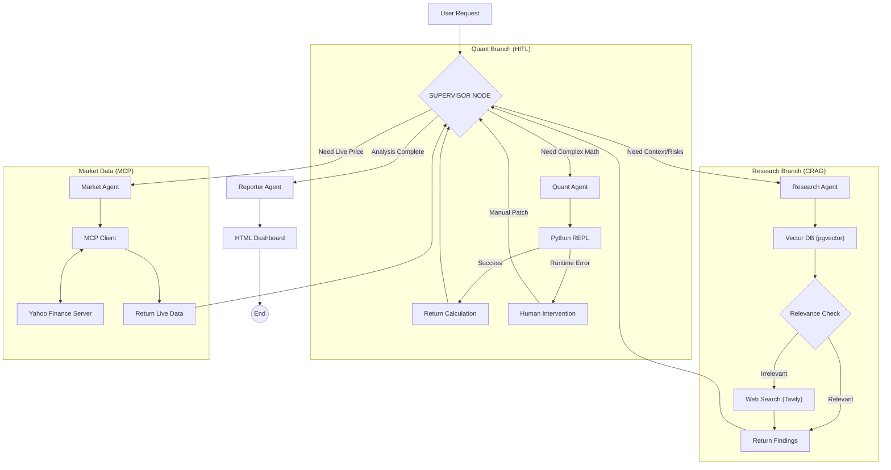

# 🏦 TITAN: Autonomous Financial Intelligence Platform

**A Hierarchical Multi-Agent System for Deep Financial Auditing & Strategy Analysis**

[](https://fastapi.tiangolo.com/)
[](https://python.langchain.com/docs/langgraph)
[](https://modelcontextprotocol.io/)
[](https://www.postgresql.org/)
[](https://smith.langchain.com/)
[](https://tailwindcss.com/)
[](https://github.com/rauldgarcia/TITAN/actions)

---

## 📖 Executive Summary

**TITAN** is not just a chatbot; it is an autonomous **Financial Analysis Engine** engineered to mimic the workflow of a human audit team. It moves beyond simple RAG by employing a **Supervisor-Worker Architecture** where a central orchestrator delegates tasks to specialized agents (Researchers, Quants, Market Analysts) to solve complex financial queries.

The system features **Self-Correction** mechanisms, **Real-Time Data Injection** via MCP, and a **Human-in-the-Loop (HITL)** protocol to handle execution failures gracefully, ensuring enterprise-grade reliability.

---

## 🏗️ System Architecture

TITAN implements a **Stateful Hierarchical Graph**. The state is persisted in PostgreSQL, allowing for long-running analysis sessions that survive service restarts.

### The "Deep Analyzer" Topology



---

## 🛠️ Tech Stack & Engineering Standards

- **Core Framework:** Python 3.12+, FastAPI (Async), Pydantic v2.
- **Agent Orchestration:** LangGraph with **AsyncPostgresSaver** for production-grade persistence using Connection Pooling (`psycopg-pool`).
- **Vector Database:** PostgreSQL 16 with `pgvector` extension.
- **Embedding Engine:** Local GPU-accelerated inference using `sentence-transformers` (CUDA).
- **Interoperability:** **Model Context Protocol (MCP)** for standardized connection to external data sources (Yahoo Finance).
- **Data Engineering:** Custom ETL pipeline using \`sec-edgar-downloader\` and \`BeautifulSoup4\` for high-fidelity HTML parsing.
- **Code Execution:** Sandboxed Python REPL for deterministic mathematical operations.
- **Observability:** Full trace monitoring via **LangSmith**.
- **Quality Assurance:** **RAGAS** (Metric-based Evaluation).
- **Reporting:** Jinja2 templating engine generating responsive TailwindCSS reports.

---

## 🚀 Getting Started

### 1\. Prerequisites

- Python 3.12+ (Managed via **Poetry**)
- Docker & Docker Compose
- NVIDIA GPU (Recommended for Vectorization)
- **Ollama** running locally (`ollama serve`) with \`llama3.2\`.

### 2\. Environment Configuration

Create a \`.env\` file in the root directory:

    # Database
    POSTGRES_USER=titan_user
    POSTGRES_PASSWORD=titan_password
    POSTGRES_SERVER=localhost
    POSTGRES_PORT=5432
    POSTGRES_DB=titan_db

    # External Tools
    TAVILY_API_KEY=tvly-xxxxxxxxxxxx
    LANGCHAIN_API_KEY=lsv2_xxxxxxxx (Optional for Tracing)
    LANGCHAIN_TRACING_V2=true
    LANGCHAIN_PROJECT=TITAN-Platform

### 3\. Installation & Deployment

    # 1. Clone Repository
    git clone https://github.com/rauldgarcia/titan-platform.git
    cd titan-platform

    # 2. Install Dependencies
    poetry install

    # 3. Provision Infrastructure (DB + pgAdmin)
    sudo docker compose up -d

    # 4. Start the API Server
    poetry run uvicorn app.main:app --reload

---

## 📊 Data Ingestion Pipeline (ETL)

Before querying, you must populate the Vector Database with SEC Filings.

    # Step 1: Download 10-K Filings (AAPL, MSFT, TSLA)
    poetry run python scripts/ingest/download_sec.py

    # Step 2: Clean and Normalize HTML
    poetry run python scripts/ingest/clean_data.py

    # Step 3: Vectorize and Load to Postgres (Uses GPU)
    poetry run python scripts/ingest/vectorize.py

---

## 🧪 Testing & Capabilities Playbook

Once the system is running, you can test its distinct capabilities via the Swagger UI (\`http://localhost:8000/docs\`) or cURL.

### 🧪 Running Tests

TITAN uses `pytest` for unit and integration testing.

```bash
poetry run pytest -v
```

### Scenario A: Deep Strategic Analysis (Supervisor + Research)

_Demonstrates RAG, Document Grading, and HTML Reporting._

    POST /chat/agent
    {
      "question": "Analyze the strategic outlook and key risk factors for Apple (AAPL)",
      "thread_id": "audit_session_01"
    }

### Scenario B: Real-Time Market Data (MCP Integration)

_Demonstrates the Model Context Protocol connecting to the custom Yahoo Finance server._

    POST /chat/agent
    {
      "question": "What is the current stock price of NVIDIA and its market cap?",
      "thread_id": "market_session_01"
    }

### Scenario C: Quantitative Reasoning (Python Tool)

_Demonstrates the Quant Agent writing and executing code._

    POST /chat/agent
    {
      "question": "Calculate the Debt-to-Revenue ratio for Microsoft assuming 50B debt and 200B revenue.",
      "thread_id": "quant_session_01"
    }

### Scenario D: Human-in-the-Loop (Error Recovery)

_Demonstrates resilience. If the Quant Agent fails (e.g., division by zero), the system pauses._

    # 1. Check Status (Will return "PAUSED")
    GET /agent/state/quant_session_01

    # 2. Patch & Resume
    POST /agent/resume
    {
      "thread_id": "quant_session_01",
      "new_instructions": "The calculated ratio is 0.25"
    }

---

## 🗺️ Project Roadmap

### ✅ Completed Milestones

- **Phase 1: Foundation**
  - \[x\] Environment Setup (Poetry, Docker, Git).
  - \[x\] Async Database Layer (Postgres + pgvector).
- **Phase 2: Data Engineering (ETL)**
  - \[x\] SEC Downloader Script.
  - \[x\] HTML-to-Text Parser (BeautifulSoup).
  - \[x\] GPU-Accelerated Vectorization (SentenceTransformers).
- **Phase 3: The Brain (Inference)**
  - \[x\] Semantic Search Service (Cosine Similarity).
  - \[x\] RAG Integration with Local LLMs (Ollama).
- **Phase 4: Agentic Workflow v1**
  - \[x\] LangGraph State Definition.
  - \[x\] Self-Correction Logic (CRAG).
  - \[x\] Web Search Fallback (Tavily).
  - \[x\] **Reporting Engine:** Jinja2 + TailwindCSS HTML Generation.
- **Phase 5: Advanced Orchestration (The "Deep Analyzer")**
  - \[x\] **Persistent Memory:** Postgres-backed thread persistence with Connection Pooling.
  - \[x\] **Hierarchical Architecture:** Supervisor-Worker topology.
  - \[x\] **Quantitative Tool:** Python REPL integration for math.
  - \[x\] **MCP Integration:** Custom Yahoo Finance MCP Server.
  - \[x\] **Resilience:** Human-in-the-Loop (HITL) error recovery.

### 🚧 Upcoming Phases

- **Phase 6: MLOps & Quality Engineering (Next Sprint)**
  - \[x\] **Testing:** Unit & Integration Testing suite (Pytest).
  - \[ \] **CI/CD:** GitHub Actions for automated linting and Docker builds.
  - \[x\] **Evaluation:** RAGAS metrics implementation.
- **Phase 7: Full Stack Experience**
  - \[ \] **Frontend Client:** React Application.
  - \[ \] **Cloud Deployment:** Deploy backend to GCP Cloud Run.

---

## 🛡️ License

Private Portfolio Project - Raúl Daniel García Ramón.
