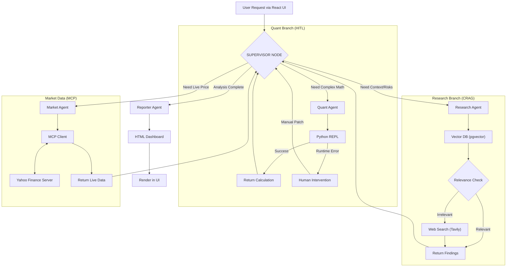

# 🏦 TITAN: Autonomous Financial Intelligence Platform

**A Hierarchical Multi-Agent System for Deep Financial Auditing & Strategy Analysis**

[](https://react.dev/)
[](https://fastapi.tiangolo.com/)
[](https://python.langchain.com/docs/langgraph)
[](https://modelcontextprotocol.io/)
[](https://www.postgresql.org/)
[](https://smith.langchain.com/)
[](https://tailwindcss.com/)
[](https://github.com/rauldgarcia/TITAN/actions)

---

## 📖 Executive Summary

**TITAN** is not just a chatbot; it is an autonomous **Financial Analysis Engine** engineered to mimic the workflow of a human audit team. It moves beyond simple RAG by employing a **Supervisor-Worker Architecture** where a central orchestrator delegates tasks to specialized agents (Researchers, Quants, Market Analysts) to solve complex financial queries.

The system features a **Cyberpunk-style Dashboard**, **Self-Correction** mechanisms, **Real-Time Data Injection** via MCP, and a **Human-in-the-Loop (HITL)** protocol to handle execution failures gracefully.

---

## 🏗️ System Architecture

TITAN implements a **Stateful Hierarchical Graph**. The state is persisted in PostgreSQL, allowing for long-running analysis sessions that survive service restarts, managed via a React Frontend.

### The Topology



---

## 🛠️ Tech Stack & Engineering Standards

- **Core Backend:** Python 3.12+, FastAPI (Async), Pydantic v2.
- **Frontend Architecture:** React 18 (Vite) with TailwindCSS v3 for a responsive, dark-mode "Glassmorphism" dashboard.
- **Agent Orchestration:** LangGraph with **AsyncPostgresSaver** for production-grade persistence using Connection Pooling (`psycopg-pool`).
- **Vector Database:** PostgreSQL 16 with `pgvector` extension hosted on Cloud SQL.
- **LLM & Embeddings:** 
  - **Production:** Google Vertex AI (Gemini 2.5 Flash Lite + text-embedding-004)
  - **Local:** Ollama (Llama 3.2) + HuggingFace Embeddings (GPU-accelerated)
- **Interoperability:** **Model Context Protocol (MCP)** for standardized connection to external data sources (Yahoo Finance).
- **Data Engineering:** Custom ETL pipeline using \`sec-edgar-downloader\` and \`BeautifulSoup4\` for high-fidelity HTML parsing.
- **Code Execution:** Sandboxed Python REPL for deterministic mathematical operations.
- **Observability:** Full trace monitoring via **LangSmith**.
- **Quality Assurance:** **RAGAS** (Metric-based Evaluation).
- **Reporting:** Jinja2 templating engine generating responsive TailwindCSS reports.
- **CI/CD & Quality:** Automated pipelines via **GitHub Actions**, enforcing strict linting/formatting with **Ruff** and type safety.

---

## 🚀 Getting Started

### 1\. Prerequisites

- Python 3.12+ (Poetry) & Node.js 18+ (NPM)
- Docker & Docker Compose
- NVIDIA GPU (Recommended for Vectorization)
- **Ollama** running locally (`ollama serve`) with \`llama3.2\`.

### 2\. Environment Configuration

#### Local Development

Create a `.env` file in the root directory:

```bash
# Environment
ENVIRONMENT=local

# Database (Local)
POSTGRES_USER=titan_user
POSTGRES_PASSWORD=titan_password
POSTGRES_SERVER=localhost
POSTGRES_PORT=5432
POSTGRES_DB=titan_db

# External Tools
TAVILY_API_KEY=tvly-xxxxxxxxxxxx
LANGCHAIN_API_KEY=lsv2_xxxxxxxx  # Optional for Tracing
LANGCHAIN_TRACING_V2=true
LANGCHAIN_PROJECT=TITAN-Platform
```

#### Production (Cloud Run)

For production deployment, additional environment variables are configured in GitHub Actions:

```bash
# Environment
ENVIRONMENT=production

# Database (Cloud SQL via Unix Socket)
POSTGRES_SERVER=none  # Not used with Cloud SQL Proxy
INSTANCE_CONNECTION_NAME=evidentedesarrollo:us-central1:titan-db-prod

# Google Cloud
GOOGLE_CLOUD_PROJECT=evidentedesarrollo
```

### 3\. Installation & Deployment

    # 1. Clone Repository
    git clone https://github.com/rauldgarcia/titan-platform.git
    cd titan-platform

    # 2. Install Dependencies
    poetry install

    # 3. Provision Infrastructure (DB + pgAdmin)
    sudo docker compose up -d

    # 4. Start the API Server
    poetry run uvicorn app.main:app --reload

    # 5. Frontend (Console UI)
    cd frontend
    npm install
    npm run dev
    # Access the UI at http://localhost:5173

### 4\. Cloud Deployment (Production)

The application is deployed to Google Cloud Run with automated CI/CD via GitHub Actions.

**Production Access:**
- **Frontend:** [https://titan-frontend-842951566749.us-central1.run.app](https://titan-frontend-842951566749.us-central1.run.app)
- **Backend API:** [https://titan-backend-842951566749.us-central1.run.app](https://titan-backend-842951566749.us-central1.run.app)
- **API Documentation (Swagger):** [https://titan-backend-842951566749.us-central1.run.app/docs](https://titan-backend-842951566749.us-central1.run.app/docs)

**Deployment Process:**
1. Push changes to `main` branch
2. GitHub Actions automatically builds and deploys:
   - Backend: Multi-stage Docker build → Cloud Run with Cloud SQL Proxy
   - Frontend: Vite production build → Cloud Run with API URL injection
3. Deployments complete in ~5-8 minutes (backend) and ~2-3 minutes (frontend)

**Key Production Features:**
- **Vertex AI LLM:** Using Gemini 2.5 Flash Lite for generation
- **Vertex AI Embeddings:** Using text-embedding-004 for vector search
- **Cloud SQL:** Managed PostgreSQL 16 with pgvector via Unix socket
- **Auto-scaling:** 0-10 instances based on load
- **CORS:** Configured for cross-origin frontend-backend communication


---

## 📊 Data Ingestion Pipeline (ETL)

Before querying, you must populate the Vector Database with SEC Filings.

    # Step 1: Download 10-K Filings (AAPL, MSFT, TSLA)
    poetry run python scripts/ingest/download_sec.py

    # Step 2: Clean and Normalize HTML
    poetry run python scripts/ingest/clean_data.py

    # Step 3: Vectorize and Load to Postgres (Uses GPU)
    poetry run python scripts/ingest/vectorize.py
---

## 🧪 Testing & Capabilities Playbook

### Running Tests Locally

TITAN uses `pytest` for comprehensive unit and integration testing:

```bash
poetry run pytest -v
```

**Test Coverage:**
- Unit tests for agent nodes, routing logic, and parsers
- Integration tests for database operations and API endpoints  
- Mocked external dependencies for reliable CI/CD

### Testing the System

You can test TITAN's capabilities via Swagger UI or cURL:
- **Local:** `http://localhost:8000/docs`
- **Production:** [https://titan-backend-842951566749.us-central1.run.app/docs](https://titan-backend-842951566749.us-central1.run.app/docs)

> **Note:** The system automatically selects Vertex AI (Gemini) in production and Ollama locally based on the `ENVIRONMENT` variable.

### Scenario A: Deep Strategic Analysis (Supervisor + Research)

_Demonstrates RAG, Document Grading, and HTML Reporting._

    POST /chat/agent
    {
      "question": "Analyze the strategic outlook and key risk factors for Apple (AAPL)",
      "thread_id": "audit_session_01"
    }

### Scenario B: Real-Time Market Data (MCP Integration)

_Demonstrates the Model Context Protocol connecting to the custom Yahoo Finance server._

    POST /chat/agent
    {
      "question": "What is the current stock price of NVIDIA and its market cap?",
      "thread_id": "market_session_01"
    }

### Scenario C: Quantitative Reasoning (Python Tool)

_Demonstrates the Quant Agent writing and executing code._

    POST /chat/agent
    {
      "question": "Calculate the Debt-to-Revenue ratio for Microsoft assuming 50B debt and 200B revenue.",
      "thread_id": "quant_session_01"
    }

### Scenario D: Human-in-the-Loop (Error Recovery)

_Demonstrates resilience. If the Quant Agent fails (e.g., division by zero), the system pauses._

    # 1. Check Status (Will return "PAUSED")
    GET /agent/state/quant_session_01

    # 2. Patch & Resume
    POST /agent/resume
    {
      "thread_id": "quant_session_01",
      "new_instructions": "The calculated ratio is 0.25"
    }

---

## 🗺️ Project Roadmap

### ✅ Completed Milestones

- **Phase 1: Foundation**
  - \[x\] Environment Setup (Poetry, Docker, Git).
  - \[x\] Async Database Layer (Postgres + pgvector).
- **Phase 2: Data Engineering (ETL)**
  - \[x\] SEC Downloader Script.
  - \[x\] HTML-to-Text Parser (BeautifulSoup).
  - \[x\] GPU-Accelerated Vectorization (SentenceTransformers).
- **Phase 3: The Brain (Inference)**
  - \[x\] Semantic Search Service (Cosine Similarity).
  - \[x\] RAG Integration with Local LLMs (Ollama).
- **Phase 4: Agentic Workflow v1**
  - \[x\] LangGraph State Definition.
  - \[x\] Self-Correction Logic (CRAG).
  - \[x\] Web Search Fallback (Tavily).
  - \[x\] **Reporting Engine:** Jinja2 + TailwindCSS HTML Generation.
- **Phase 5: Advanced Orchestration**
  - \[x\] **Persistent Memory:** Postgres-backed thread persistence with Connection Pooling.
  - \[x\] **Hierarchical Architecture:** Supervisor-Worker topology.
  - \[x\] **Quantitative Tool:** Python REPL integration for math.
  - \[x\] **MCP Integration:** Custom Yahoo Finance MCP Server.
  - \[x\] **Resilience:** Human-in-the-Loop (HITL) error recovery.
- **Phase 6: MLOps & Quality Engineering (Next Sprint)**
  - \[x\] **Testing:** Unit & Integration Testing suite (Pytest).
  - \[x\] **CI/CD:** GitHub Actions for automated linting and Docker builds.
  - \[x\] **Evaluation:** RAGAS metrics implementation.
- **Phase 7: Full Stack Experience**
  - \[x\] **Frontend Client:** React Application with TailwindCSS & Glassmorphism UI.
  - \[x\] **Dynamic Reporting:** Rendering Jinja2 HTML reports within React.
- **Phase 8: Cloud Deployment**
  - \[x\] **Containerization:** Multi-stage Dockerfile with optimized caching.
  - \[x\] **Google Cloud Run:** Backend deployed to Cloud Run with Cloud SQL Proxy.
  - \[x\] **Cloud SQL:** PostgreSQL 16 with pgvector extension.
  - \[x\] **Frontend Deployment:** React app deployed to Cloud Run.
  - \[x\] **CI/CD:** Automated deployment via GitHub Actions.
  - \[x\] **Vertex AI Integration:** Production LLM and embeddings using Google AI.
  - \[x\] **Production URLs:**
    - Backend API: `https://titan-backend-842951566749.us-central1.run.app`
    - Frontend: `https://titan-frontend-842951566749.us-central1.run.app`
    - API Docs: `https://titan-backend-842951566749.us-central1.run.app/docs`


---

## 🛡️ License

Private Portfolio Project - Raúl Daniel García Ramón.
