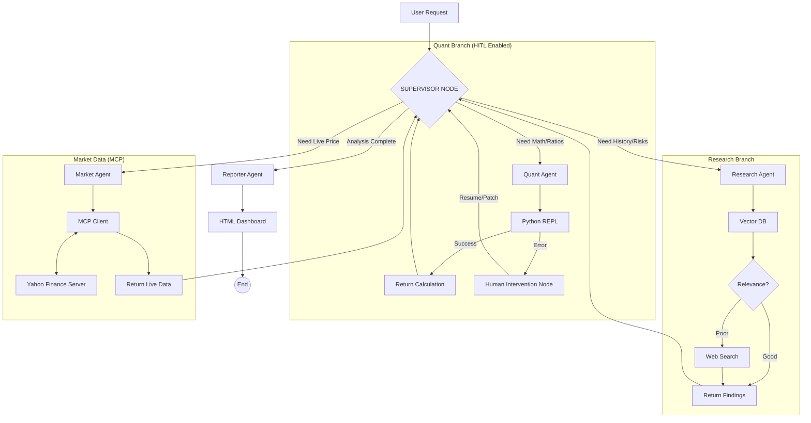

# 🏦 TITAN: Autonomous Financial Intelligence Platform

    

**TITAN** is an advanced Multi-Agent System designed to perform deep financial analysis and audit tasks on SEC 10-K filings. It employs a **Hierarchical Agentic Architecture** powered by LangGraph, where a Supervisor delegates tasks to specialized workers (Research, Quant, Market Data, Reporting).

---

## 🧠 Agentic Architecture (The "Deep Analyzer")

TITAN utilizes a **Supervisor-Worker** topology with **Human-in-the-Loop (HITL)** capabilities for error recovery. If the Quant Agent fails (e.g., Python math error), the system pauses execution and waits for manual intervention.

---

## 🎮 Human-in-the-Loop Protocol (Error Recovery)

TITAN implements a **"Pause & Resume"** mechanism for handling critical failures during execution.

### 1\. Detection & Pause

If the **Quant Agent** encounters a runtime error, the graph state transitions to \`human_intervention\` and pauses.

    // API Response (Status 200)
    {
      "status": "PAUSED",
      "message": "Agent paused for human intervention.",
      "error": "Quant execution failed: ZeroDivisionError"
    }

### 2\. Inspection

    GET /agent/state/{thread_id}

### 3\. Manual Correction (Patch)

The operator can inject the correct value or instruction to bypass the faulty node.

    POST /agent/resume
    {
      "thread_id": "session_123",
      "new_instructions": "The calculated Debt-to-Equity ratio is 1.5"
    }

---

## 🏗️ Architecture & Tech Stack

- **Core Backend:** Python 3.12+, FastAPI (Async), SQLModel.
- **Orchestration:** LangGraph (Hierarchical StateGraph with PostgreSQL Persistence).
- **Connectivity:** **Model Context Protocol (MCP)** client/server architecture for external data.
- **Database:** PostgreSQL 16 + `pgvector` (Dockerized).
- **Inference:** Local LLMs via **Ollama** (Llama 3.2).
- **Resilience:** Human-in-the-Loop (HITL) checkpoints and Circuit Breakers.
- **Reporting:** Jinja2 + TailwindCSS (Glassmorphism UI).

---

## 🗺️ Project Roadmap

### ✅ Completed Phases

- **Phase 1: Foundation** (DB, Docker, Async Config).
- **Phase 2: Data Engineering** (ETL, SEC Parsing).
- **Phase 3: The Brain** (Vector Search, Embeddings).
- **Phase 4: Agentic Workflow v1** (Self-Correction, Web Search).
- **Phase 5: Advanced Orchestration (The "Deep Analyzer")**
  - \[x\] **Persistent Memory:** Replace in-memory checkpointer with PostgreSQL persistence.
  - \[x\] **Hierarchical Agents:** Supervisor-Worker topology.
  - \[x\] **Quantitative Tool:** Python REPL integration.
  - \[x\] **MCP Integration:** Real-time market data via Model Context Protocol.
  - \[x\] **Human-in-the-Loop:** Error recovery mechanism via API checkpoints.

### 🚧 In Progress & Future Steps

- **Phase 6: MLOps & Quality Engineering**
  - \[ \] **Unit & Integration Testing:** Comprehensive Pytest suite for agents and API.
  - \[ \] **CI/CD Pipelines:** GitHub Actions for automated linting, testing, and Docker builds.
  - \[ \] **Evaluation:** Implement RAGAS to measure retrieval accuracy.
- **Phase 7: Full Stack Experience**
  - \[ \] **Frontend Client:** React Application.
  - \[ \] **Cloud Deployment:** Deploy backend to GCP Cloud Run.

---

## 🛡️ License

Private Portfolio Project - Raúl Daniel García Ramón.
